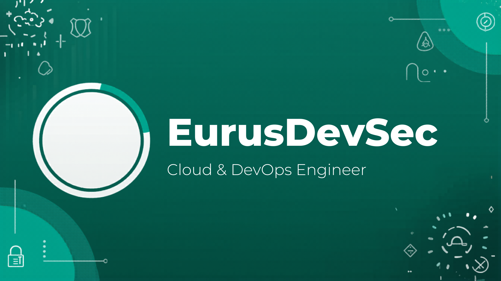
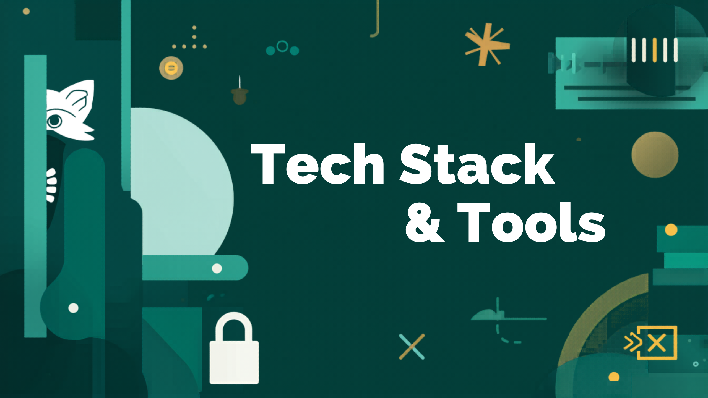
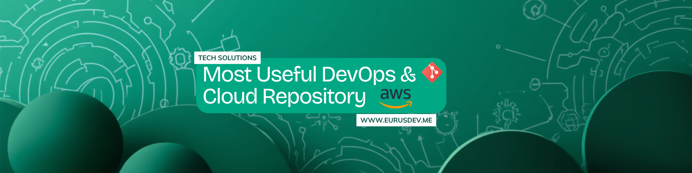
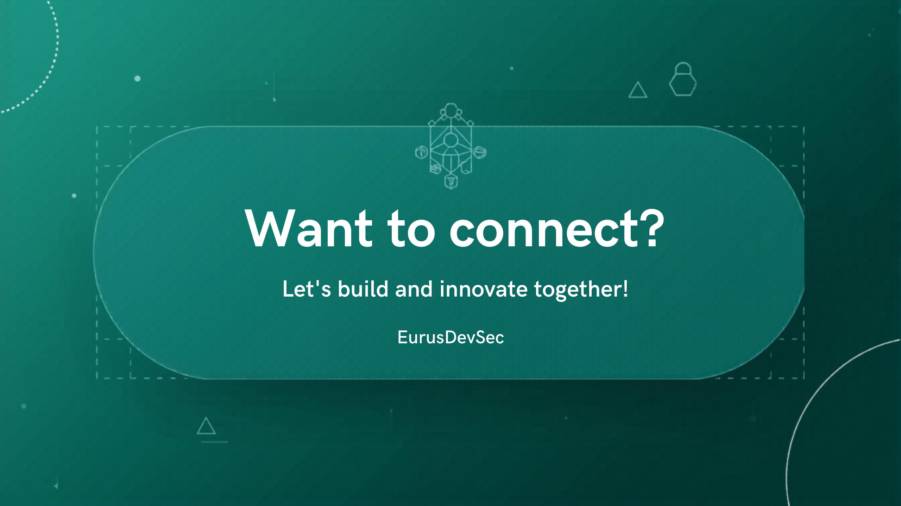

 

# E U R U S D E V S E C

### DevSecOps & Cloud-Native Engineer

`DevOps` · `DevSecOps` · `Cloud-Native` · `Platform Engineering` · `SRE`

**Building scalable cloud infrastructure, secure cloud-native applications, and reliable DevOps platforms.**

 

---

**_I architect production-grade cloud platforms, build zero-trust security pipelines, and engineer self-healing Kubernetes systems that solve real enterprise problems — from multi-cluster governance to automated FinOps. I publish open-source DevOps & Cloud-Native tooling and write technical content for the community._**

---

## ⚡ Tech Stack & Tools

  

### ☁️ Cloud Platforms

### 🧱 Containers & Orchestration

### ⚙️ CI/CD & Automation

### 🛡️ Security & Policy

### 🛠️ Infrastructure, Monitoring & Observability

---

## 📂 Featured Projects

> **💡 Philosophy:** Every project below solves a **real enterprise pain point** — not a tutorial demo. Each is designed with production-grade architecture, comprehensive documentation, and measurable business outcomes.

### 🔧 DevOps & Infrastructure

| Project                                                                                 | Description                                                                                                                          |
| --------------------------------------------------------------------------------------- | ------------------------------------------------------------------------------------------------------------------------------------ |
| [Multi-Cloud GitOps Fleet Manager](https://github.com/EurusDevSec/gitops-fleet-manager) | Manage 50+ Kubernetes clusters across AWS/Azure/GCP with unified GitOps governance, automatic drift detection & remediation          |
| [Zero-Trust CI/CD Fortress](https://github.com/EurusDevSec/zerotrust-cicd-fortress)     | End-to-end secure pipeline with artifact signing, SBOM generation, runtime vulnerability correlation & policy-as-code gates          |
| [Cloud FinOps Autopilot](https://github.com/EurusDevSec/cloud-finops-autopilot)         | Automated cloud cost governance — real-time anomaly detection, idle resource cleanup, Savings Plan optimizer & chargeback dashboards |

### 🏗️ Platform Engineering & SRE

| Project                                                                                         | Description                                                                                                                     |
| ----------------------------------------------------------------------------------------------- | ------------------------------------------------------------------------------------------------------------------------------- |
| [Internal Developer Platform (IDP)](https://github.com/EurusDevSec/developer-platform-idp)      | Self-service developer portal with golden path templates, automated environment provisioning & embedded security guardrails     |
| [Kubernetes Resilience Engine](https://github.com/EurusDevSec/k8s-resilience-engine)            | Self-healing K8s with chaos engineering integration, SLO-driven auto-rollback, automated runbook execution & Game Day framework |
| [Unified Observability Platform](https://github.com/EurusDevSec/unified-observability-platform) | Full-stack observability with OpenTelemetry, intelligent alerting, SLO dashboards & AI-assisted root cause analysis             |

### 📱 Additional Development

| Project                                                                           | Description                                                         |
| --------------------------------------------------------------------------------- | ------------------------------------------------------------------- |
| [E-commerce Microservices](https://github.com/EurusDevSec/ecommerce_Microservice) | Cloud-native microservices on GCP with Gateway, GKE, and PostgreSQL |
| [vibraGuard](https://github.com/EurusDevSec/vibraGuard)                           | AI security system classifying vibrations using TinyML on ESP32-C3  |

---

## 🌐 Learning Hub

> **📚 Curated learning paths** — from zero to production. Each path includes hands-on labs, real-world scenarios, and certification prep.

| Resource                                                                   | Description                                                                     |
| -------------------------------------------------------------------------- | ------------------------------------------------------------------------------- |
| [☁️ AWS Solutions Architect Path](learning-hub/aws-solutions-architect.md) | VPC design, multi-account strategy, Well-Architected Framework, SAA-C03 prep    |
| [🚀 Kubernetes Mastery](learning-hub/kubernetes-mastery.md)                | From pods to production — CKA/CKAD prep, multi-cluster, service mesh, operators |
| [🔐 DevSecOps Engineering](learning-hub/devsecops-engineering.md)          | Shift-smart security, supply chain hardening, compliance automation, SBOM       |
| [🏗️ Terraform & IaC at Scale](learning-hub/terraform-iac-at-scale.md)      | Module design, state management, CI/CD integration, multi-cloud patterns        |
| [📊 SRE & Observability](learning-hub/sre-observability.md)                | SLI/SLO/SLA, incident management, chaos engineering, OpenTelemetry              |
| [💰 FinOps Practitioner](learning-hub/finops-practitioner.md)              | Cloud economics, cost allocation, optimization strategies, FinOps certification |

---

## 📊 GitHub Stats

  

  

---

## 🤝 Want to Connect?

  

**Let's build, secure, and automate cloud-native systems together.**

 

  

_Like my work? Support it._

